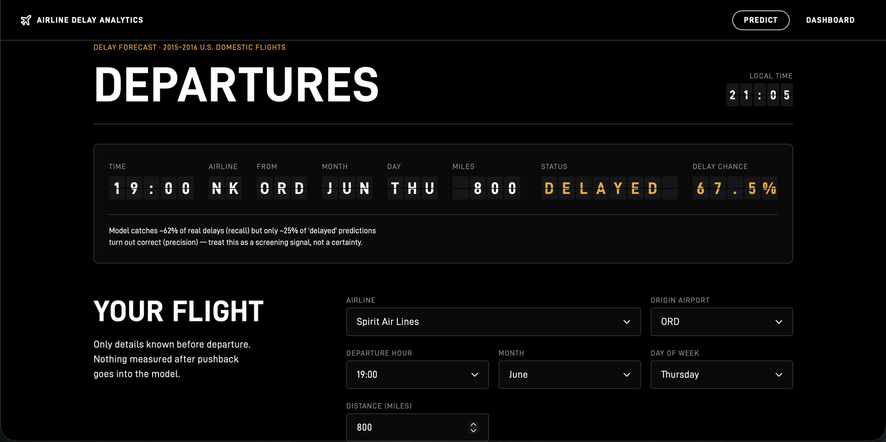
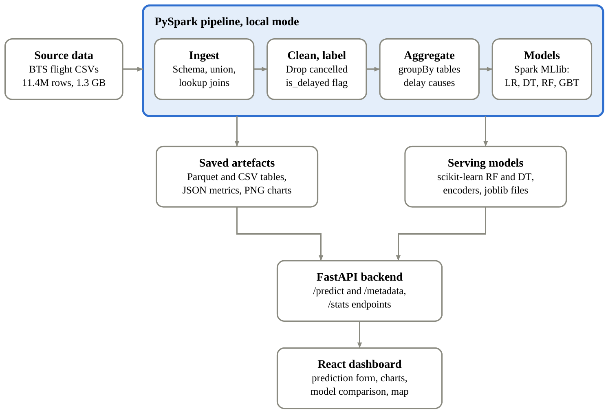
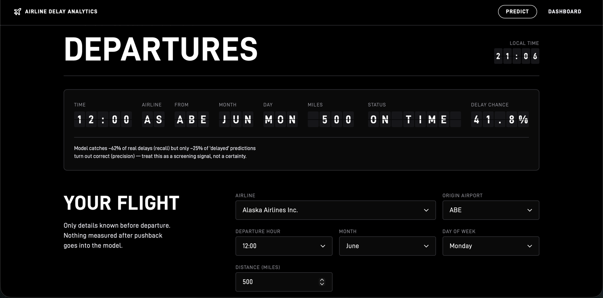
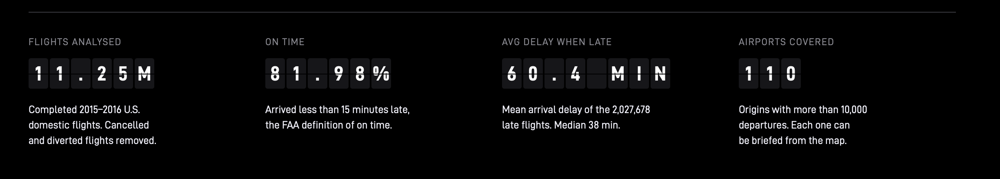
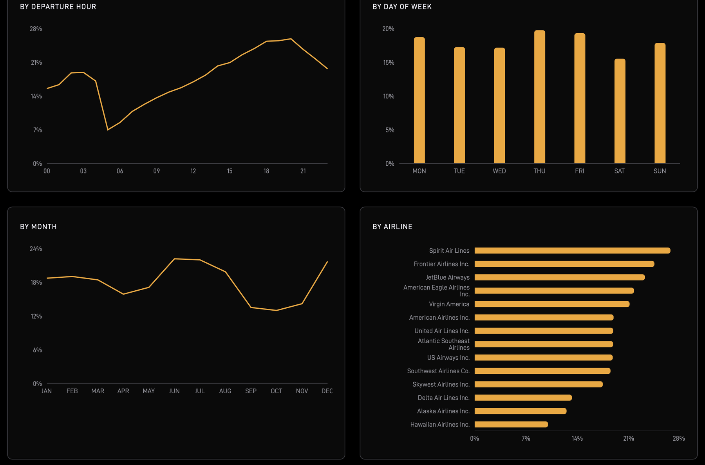
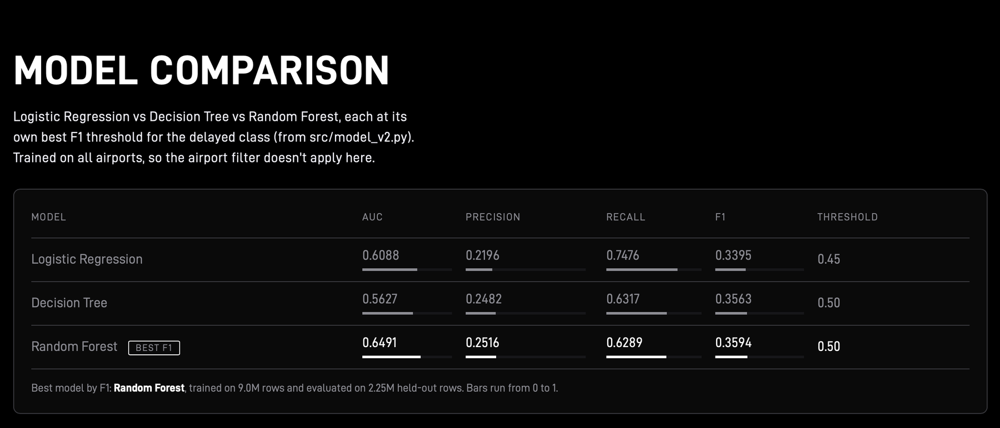
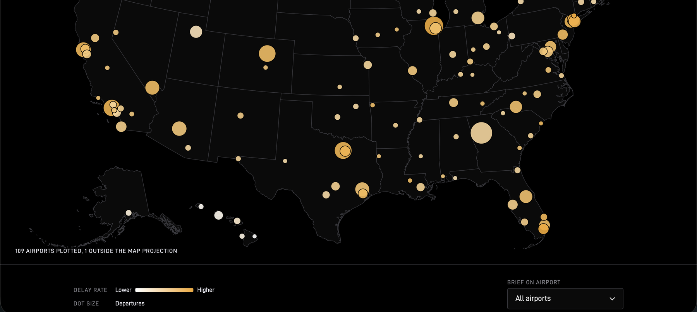
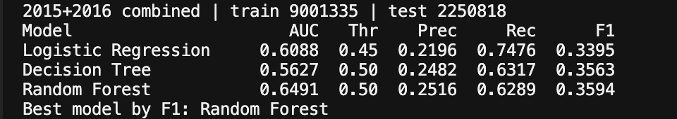
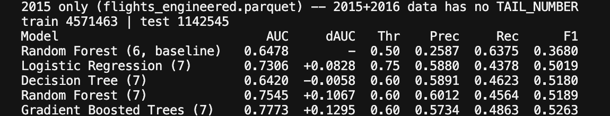

# ✈️ Airline Flight Delay Analytics & Prediction

**Big Data Analytics mini project** · St. Francis Institute of Technology, Mumbai

A PySpark pipeline that processes **11.25 million** U.S. domestic flights (2015–2016), finds
out *where, when and why* flights get delayed, trains four classifiers with Spark MLlib, and
serves the best ones through a **FastAPI + React dashboard** where you can type in a flight
and get a delay prediction.

> **In one line:** give it an airline, an airport, a date and a departure hour, and it tells
> you whether the flight is likely to arrive 15+ minutes late, plus how confident it is.



---

## Table of contents

1. [What problem does this solve?](#-what-problem-does-this-solve)
2. [Key results at a glance](#-key-results-at-a-glance)
3. [How it works (architecture)](#-how-it-works)
4. [Screenshots](#-screenshots)
5. [Tech stack](#-tech-stack)
6. [Dataset](#-dataset)
7. [Models and results](#-models-and-results)
8. [Project structure](#-project-structure)
9. [Run it yourself](#-run-it-yourself)
10. [API reference](#-api-reference)
11. [Ideas and limitations](#-limitations-and-future-work)
12. [Authors](#-authors)

---

## 🎯 What problem does this solve?

About **1 in 5 US flights arrives 15 minutes or more late**. Delays cost airlines and
passengers money, but the data behind them is huge: millions of rows across many files, too
big to open in Excel. This project shows how a Big Data tool (**Apache Spark**) handles that
scale and turns it into something useful:

- **Descriptive:** which airlines, airports, hours, weekdays and months are the most delay-prone?
- **Diagnostic:** what *causes* the delays (weather, carrier, air traffic, late aircraft, security)?
- **Predictive:** can we predict, *at booking time*, whether a flight will be delayed?

The target the models predict is:

| Label | Meaning |
|-------|---------|
| `is_delayed = 1` | Arrived **15 minutes or more** late (the FAA definition of "delayed") |
| `is_delayed = 0` | On time or less than 15 minutes late |

---

## 📌 Key results at a glance

| | |
|---|---|
| Flights analysed | **11,252,153** (after removing 184,584 cancelled/diverted) |
| Flights that arrive on time | **81.98%** (so **18.02%** are delayed) |
| Average delay when late | **60.4 min** (median 38 min) |
| Airports covered | **110** with more than 10,000 departures (323 airports in the raw data) |
| Best booking-time model | Random Forest, **AUC 0.649** |
| Best model with aircraft-history feature | Gradient Boosted Trees, **AUC 0.777** (+0.13) |
| #1 cause of delay | **Late Aircraft Delay**: the previous flight of the same plane was late |

**A key lesson:** an "always on time" model is already **82% accurate** because most flights
are on time, yet it never catches a single delay. So this project judges models by **AUC,
recall, precision and F1**, not accuracy, and fixes the imbalance with class weights and a tuned
decision threshold.

---

## 🧩 How it works



1. **Ingest** the raw CSVs with an explicit schema, join the airline and airport lookup tables.
2. **Clean and label**: drop cancelled/diverted flights, create the `is_delayed` target.
3. **Aggregate** with Spark `groupBy`: delay rate by airline, airport, hour, weekday, month, and the delay-cause totals.
4. **Model** with Spark MLlib: Logistic Regression, Decision Tree, Random Forest, and Gradient Boosted Trees.
5. **Export** lightweight scikit-learn versions of the models (`joblib`) so the web API can load them without a Spark runtime.
6. **Serve** with FastAPI (`/predict` and `/stats/*`) and a React dashboard.

Only information known **before the flight departs** is used as input (airline, origin
airport, month, day of week, scheduled departure hour, distance). Anything known only
afterwards (actual departure time, taxi time, the delay reasons) is excluded on purpose,
because it would be **data leakage** and make the scores look fake-good.

---

## 📸 Screenshots

### Live prediction

Enter a flight and get a verdict with a probability. The page is styled like an airport departure board.

| Predicted DELAYED (67.5%) | Predicted ON TIME (41.8%) |
|---|---|
|  |  |

| Airline | Origin | Month | Day | Departure | Distance | Result |
|---------|--------|-------|-----|-----------|----------|--------|
| Spirit Air Lines | ORD | June | Thursday | 19:00 | 800 mi | **DELAYED**, 67.5% |
| Alaska Airlines | ABE | June | Monday | 12:00 | 500 mi | **ON TIME**, delay chance 41.8% (below the 50% cut-off) |

### Dashboard: headline numbers



### Dashboard: when and who gets delayed

Delay rate by **hour of day**, **day of week**, **month** and **airline**.
Delays build up through the day (a few percent early in the morning, about a quarter in the
evening) because late planes pass their delay on to later flights.



### Dashboard: model comparison

Logistic Regression vs Decision Tree vs Random Forest on the same test data.



### Dashboard: airport delay map

Each dot is an airport (sized by departures, coloured by delay rate). Click one to brief it.



### Saved metrics (terminal output)

Both experiments write their numbers to `outputs/metrics/*.json`.





---

## 🛠 Tech stack

| Layer | Tools |
|-------|-------|
| Big data processing | Apache **PySpark** (local mode), **Spark SQL**, Parquet columnar storage |
| Machine learning | **Spark MLlib** (Logistic Regression, Decision Tree, Random Forest, GBT), scikit-learn for the serving models, joblib |
| Analysis and charts | pandas, Matplotlib, Seaborn, Jupyter / Google Colab |
| Backend | **FastAPI**, Uvicorn |
| Frontend | **React 18** + Vite, Recharts, react-simple-maps, React Router |
| Version control | Git, GitHub |

---

## 📂 Dataset

U.S. Department of Transportation **on-time performance** data, from Kaggle.

| Dataset | Used for |
|---------|----------|
| [`yuanyuwendymu/airline-delay-and-cancellation-data-2009-2018`](https://www.kaggle.com/datasets/yuanyuwendymu/airline-delay-and-cancellation-data-2009-2018): the 2015 and 2016 files | Main combined dataset: **11,436,737** raw rows (1.3 GB), 11,252,153 after cleaning |
| [`usdot/flight-delays`](https://www.kaggle.com/datasets/usdot/flight-delays) | 2015-only data; the only one with aircraft **tail numbers**, needed for the aircraft-history experiment. Also supplies `airlines.csv` and `airports.csv` lookups |

The raw CSVs are **not** in this repository (too large). See [Run it yourself](#-run-it-yourself).

---

## 🤖 Models and results

### 1. Booking-time models (6 features, combined 2015–2016 data)

Features: **airline, origin airport, month, day of week, scheduled departure hour, distance**.
Split: 80% train (9,001,335 rows) / 20% test (2,250,818 rows).

| Model | AUC | Threshold | Precision | Recall | F1 |
|-------|-----|-----------|-----------|--------|----|
| Logistic Regression | 0.6088 | 0.45 | 0.2196 | 0.7476 | 0.3395 |
| Decision Tree | 0.5627 | 0.50 | 0.2482 | 0.6317 | 0.3563 |
| **Random Forest** | **0.6491** | 0.50 | 0.2516 | 0.6289 | 0.3594 |

Booking-time information alone is only weakly predictive. A random model would score 0.50
AUC, so around 0.65 is a real but modest signal.

### 2. The aircraft-history experiment

EDA showed **Late Aircraft Delay** is the biggest cause of delay minutes (about 39.5%). So we
added one feature, **`PREV_FLIGHT_DELAYED`**: *was the same plane's previous flight late?*
It is built with a Spark window function over each tail number, ordered by departure time.

This only works on the 2015 data (it has tail numbers). Test set: 1,142,545 flights.

| Model | AUC | Change vs baseline | Threshold | Precision | Recall | F1 |
|-------|-----|--------------------|-----------|-----------|--------|----|
| Baseline RF (6 features) | 0.6478 | – | – | – | – | – |
| Logistic Regression + feature | 0.7306 | +0.0828 | 0.75 | 0.5880 | 0.4378 | 0.5019 |
| Decision Tree + feature | 0.6420 | −0.0058 | 0.60 | 0.5891 | 0.4623 | 0.5180 |
| Random Forest + feature | 0.7545 | +0.1067 | 0.60 | 0.6012 | 0.4564 | 0.5189 |
| **Gradient Boosted Trees + feature** | **0.7773** | **+0.1295** | 0.60 | 0.5734 | 0.4863 | 0.5263 |

AUC jumps from **0.65 to 0.78**, and precision more than doubles (about 0.25 to about 0.59).
The catch: you only know whether the previous flight was late **on the day of travel**, so
this is a *day-of-operations* model, kept separate from the booking-time model the dashboard serves.

### 3. Handling class imbalance

Only 18% of flights are delayed, so a naive model just predicts "on time" for everything.
We fix this two ways:

- **Class weights**: delayed flights count about 4.4x more during training.
- **Threshold tuning**: pick the probability cut-off that maximises F1 instead of using 0.5.

---

## 📁 Project structure

```text
Airline-Delay-Analytics/
├── src/                      # PySpark pipeline, one script per stage
│   ├── ingest_v2.py          #   load + join the combined 2015-2016 CSVs  -> Parquet
│   ├── clean_v2.py           #   drop cancelled/diverted, build is_delayed label
│   ├── aggregate_v2.py       #   delay rate by airline/airport/hour/day/month, causes
│   ├── aggregate_dashboard_v2.py  # extra aggregates for the dashboard
│   ├── eda_v2.py             #   chart PNGs
│   ├── model_v2.py           #   LR / DT / RF on the combined data
│   ├── export_model_v2.py    #   scikit-learn models for the API (joblib)
│   ├── feature_engineer.py   #   PREV_FLIGHT_DELAYED (aircraft history, 2015 only)
│   ├── model_v3.py           #   aircraft-history experiment (LR/DT/RF/GBT)
│   └── extend_sweep_v3.py    #   wider threshold sweep for the v3 models
│   (ingest.py, clean.py, ... are the original 2015-only versions, kept for comparison)
├── backend/
│   ├── main.py               # FastAPI app: /predict and /stats/*
│   └── model/                # exported .joblib models (not committed)
├── frontend/                 # React + Vite dashboard
│   └── src/pages/            #   PredictPage.jsx, DashboardPage.jsx
├── notebooks/analysis.ipynb  # Colab-ready end-to-end analysis
├── outputs/
│   ├── charts/               # EDA PNGs
│   └── metrics/              # model results as JSON/CSV
├── docs/screenshots/         # images used in this README
├── requirements.txt
└── data/                     # raw + processed data (git-ignored)
```

---

## 🚀 Run it yourself

**Requirements:** Python 3.10+, Java 11 or 17 (needed by Spark), Node.js 18+, about 8 GB RAM.

### 1. Setup

```bash
git clone https://github.com/Manasjadhav16/Airline-Delay-Analytics.git
cd Airline-Delay-Analytics

python3 -m venv .venv
source .venv/bin/activate          # Windows: .venv\Scripts\activate
pip install -r requirements.txt
```

### 2. Get the data (needs a free Kaggle account and API token)

```bash
# Combined 2015-2016 dataset (main pipeline)
kaggle datasets download -d yuanyuwendymu/airline-delay-and-cancellation-data-2009-2018 -p data/raw_v2 --unzip
# keep only the 2015 and 2016 CSVs in data/raw_v2/

# 2015-only dataset with tail numbers + lookups (aircraft-history experiment)
kaggle datasets download -d usdot/flight-delays -p data/raw --unzip
```

### 3. Run the Spark pipeline (from the project root)

```bash
python3 src/ingest_v2.py
python3 src/clean_v2.py
python3 src/aggregate_v2.py
python3 src/aggregate_dashboard_v2.py
python3 src/eda_v2.py
python3 src/model_v2.py             # trains LR / DT / RF, writes outputs/metrics/
python3 src/export_model_v2.py      # writes backend/model/*.joblib for the API
```

Optional aircraft-history experiment (uses the 2015 data in `data/raw`):

```bash
python3 src/ingest.py && python3 src/clean.py
python3 src/feature_engineer.py
python3 src/model_v3.py
python3 src/extend_sweep_v3.py
```

### 4. Start the dashboard

Terminal 1, the API (from the project root):

```bash
uvicorn backend.main:app --reload
# http://127.0.0.1:8000  (interactive docs at /docs)
```

Terminal 2, the frontend:

```bash
cd frontend
npm install
npm run dev
# open the URL Vite prints, usually http://localhost:5173
```

> Don't want to wait for Spark? Open `notebooks/analysis.ipynb` in Google Colab, which
> runs the whole analysis end to end.

---

## 🔌 API reference

Base URL: `http://127.0.0.1:8000`

| Endpoint | Method | Returns |
|----------|--------|---------|
| `/metadata` | GET | Airlines, airports and other options for the form |
| `/predict` | POST | Delay verdict and probability for one flight |
| `/stats/model-comparison` | GET | Three-way model metrics |
| `/stats/airport-map` | GET | Per-airport coordinates, departures, delay rate |
| `/stats/dow-hour` | GET | National delay rate by day of week and hour |
| `/stats/delay-minutes` | GET | Delay minutes split by cause |
| `/stats/airport/{code}` | GET | Breakdown for one airport |
| `/stats/{category}` | GET | Delay rate by airline / month / hour / etc. |

Example request:

```bash
curl -X POST http://127.0.0.1:8000/predict \
  -H "Content-Type: application/json" \
  -d '{"airline":"Spirit Air Lines","origin_airport":"ORD","month":6,"day_of_week":4,"scheduled_hour":19,"distance":800}'
```

`airline` is the full airline name, `origin_airport` the 3-letter code, `day_of_week` runs 1 (Monday) to 7 (Sunday), and `scheduled_hour` is 0–23. The response holds `prediction` (`delayed` or `on-time`), `probability` and a `confidence_note`. The list of valid values is at `/metadata`, and the full schema at `/docs`.

---

## ⚠️ Limitations and future work

- **Booking-time prediction is inherently weak** (AUC about 0.65): schedules alone don't know about the weather or what the plane did earlier.
- The **aircraft-history model** (AUC 0.78) can only be used on the day of travel, and only for 2015 because the 2016 files have no tail numbers.
- The dataset ends in 2016, so patterns may have shifted since.
- Spark runs in **local mode** on one laptop; the same code would scale to a cluster unchanged.

**Next steps**

- Add **weather** features (METAR / hourly observations) to the booking-time model.
- Feed **live aircraft status** into the day-of-operations model.
- Add airport congestion features (flights per hour at the origin).
- Searchable airport picker with full names and a "popular airports" group.
- Tune hyper-parameters and try SHAP for explanations.

---

## 👨‍💻 Authors

| Name | Class |
|------|-------|
| **Manas Jadhav** | BE CMPN B, Roll 02 |
| **Swen Lemos** | BE CMPN B, Roll 09 |

**Supervisor:** Monlisa Lopes · Department of Computer Engineering,
St. Francis Institute of Technology, Mumbai · AY 2026–2027
