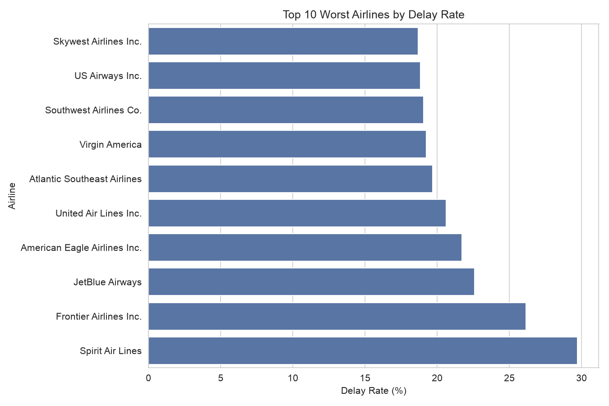
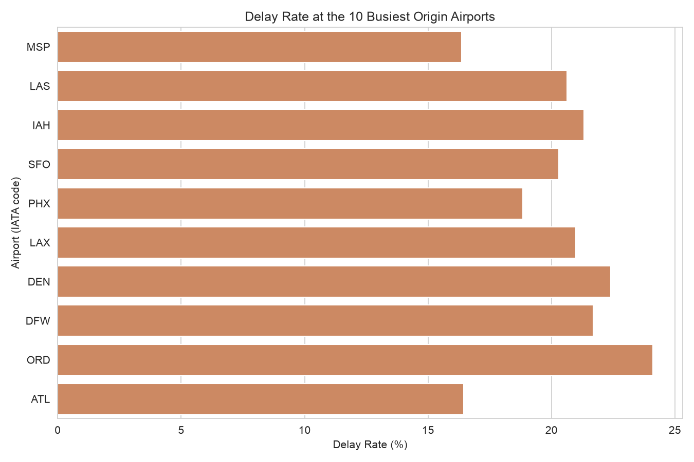
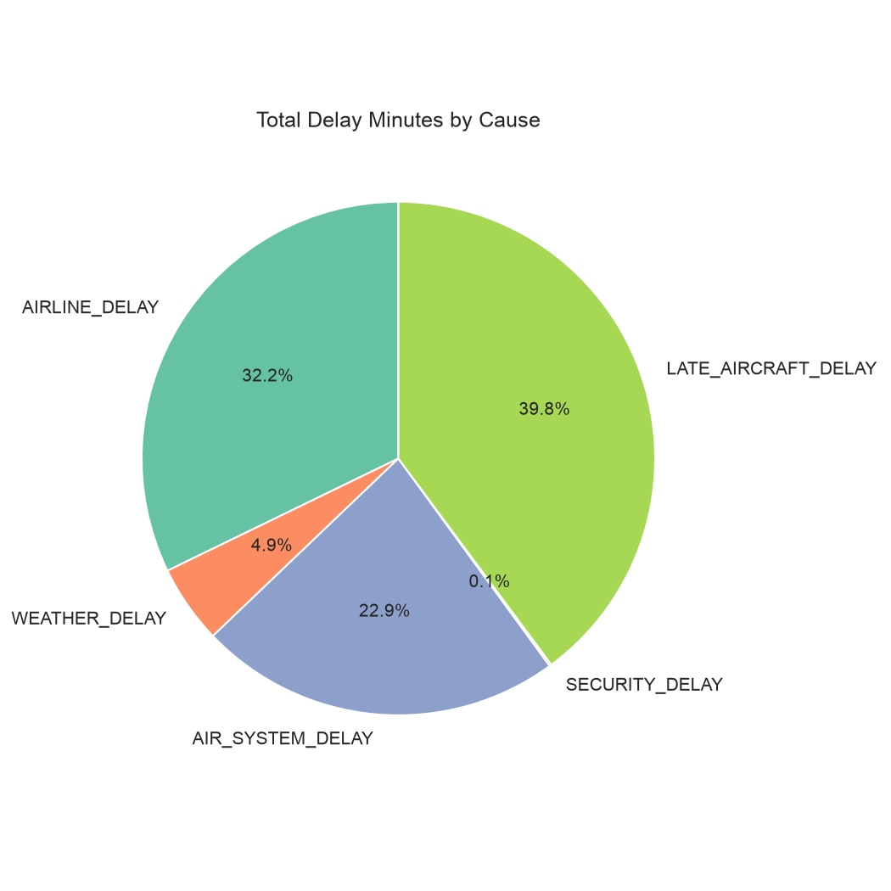
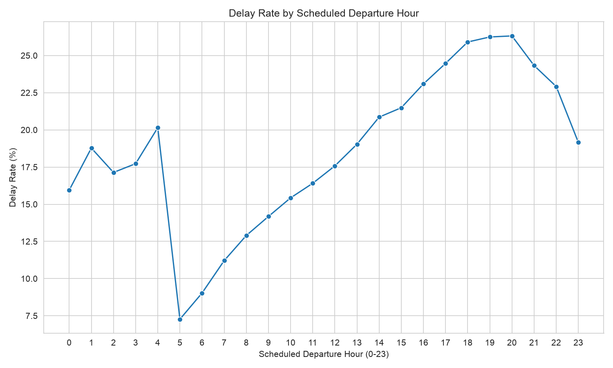
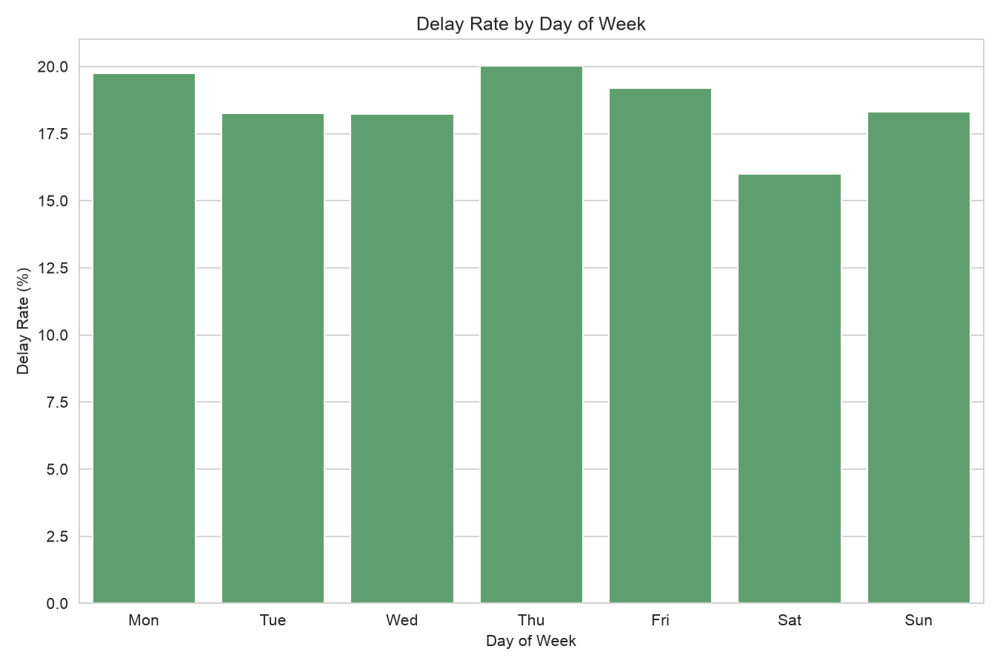
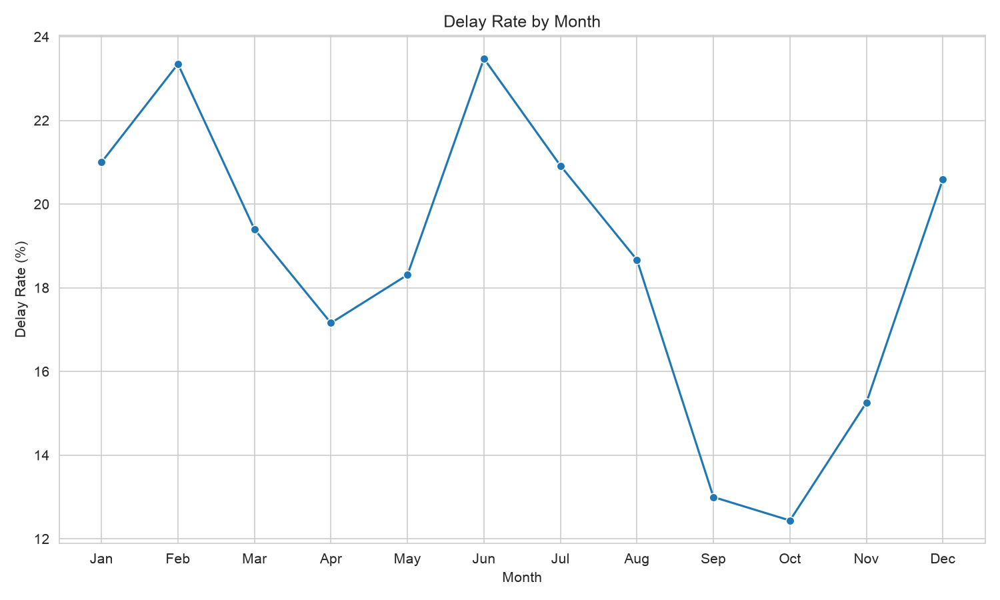

# ✈️ Airline Flight Delay Analytics & Prediction using Apache Spark

A **Big Data Analytics** pipeline that processes millions of historical U.S. domestic
flight records to uncover delay patterns and predict flight delays using a **Random
Forest classifier** trained with **Apache Spark MLlib**.

The pipeline is built entirely on **PySpark** for distributed-style processing,
simulating a Hadoop/Spark big data cluster on real-world scale data (5.8M+ records),
paired with **Matplotlib/Seaborn** visualizations and a Colab-ready analysis notebook.

---

# 📌 Project Overview

Flight delays are a major operational and financial pain point for airlines, airports,
and passengers — driven by a tangle of factors including weather, air traffic
congestion, aircraft turnaround issues, and carrier-specific inefficiencies.

This project analyzes historical U.S. Department of Transportation flight data at
scale to identify which airlines, airports, and time periods are most delay-prone,
then builds a predictive model that flags high delay-risk flights **before departure**
— using only information available at scheduling time (no post-flight data leakage).

---

# ✨ Features

- Processes 5.8M+ historical flight records using distributed Spark processing
- Aggregated delay analysis by airline, airport, day-of-week, month, and hour-of-day
- Delay-cause breakdown (weather, carrier, air traffic, late aircraft, security)
- Random Forest delay prediction model with feature importance analysis
- Report and presentation-ready chart generation
- Colab-runnable end-to-end notebook
- Clean, modular pipeline — each stage runs standalone

---

# 🛠 Tech Stack

## Data Processing

- Apache Spark (PySpark)
- Parquet (columnar storage)

## Machine Learning

- Spark MLlib
- Random Forest Classifier
- Logistic Regression (baseline)

## Visualization

- Matplotlib
- Seaborn
- Jupyter / Google Colab

## Version Control

- Git
- GitHub

---

# 🤖 Model

**Algorithm**

```text
Random Forest Classifier (Spark MLlib)
```

The model predicts a binary target:

- `is_delayed = 1` → Arrival delay ≥ 15 minutes (FAA-standard definition)
- `is_delayed = 0` → On-time or minor delay

**Features used** (pre-flight-known only — no data leakage):
Airline, Origin Airport, Month, Day of Week, Scheduled Departure Hour, Distance

---

# 📂 Dataset

The model is trained using the **Kaggle 2015 U.S. Flight Delays dataset**
(sourced from the Department of Transportation):

- **flights.csv** – ~5.8M individual flight records
- **airlines.csv** – IATA code → airline name lookup
- **airports.csv** – IATA code → airport name, city, coordinates

The datasets are joined, cleaned, and filtered (cancelled/diverted flights removed)
before feature engineering and model training.

---

# ⚙️ Project Workflow

```text
Kaggle Dataset (flights + airlines + airports)
        │
        ▼
Ingest (Spark load + schema + joins)
        │
        ▼
Clean + Label (is_delayed target creation)
        │
        ▼
Aggregate (delay rate by airline/airport/month/hour)
        │
        ▼
EDA (chart generation)
        │
        ▼
Predict (Random Forest classifier)
        │
        ▼
Notebook (Colab) + Report (Word) + Presentation (PPT)
```

---

# 📁 Project Structure

```text
airline-delay-analytics/
│
├── src/
├── data/
│   ├── raw/
│   └── processed/
├── notebooks/
├── outputs/
│   ├── charts/
│   └── metrics/
├── docs/
├── tests/
├── CLAUDE.md
├── STRUCTURE.md
├── README.md
└── requirements.txt
```

---

# 🚀 Installation

## Clone Repository

```bash
git clone https://github.com/YOUR_USERNAME/airline-delay-analytics.git
```

```bash
cd airline-delay-analytics
```

## Setup

Create a virtual environment

```bash
python -m venv venv
```

Activate (Mac/Linux)

```bash
source venv/bin/activate
```

Install dependencies

```bash
pip install -r requirements.txt
```

## Get the Dataset

```bash
kaggle datasets download -d usdot/flight-delays -p data/raw --unzip
```

## Run the Pipeline

```bash
python3 src/ingest.py
python3 src/clean.py
python3 src/aggregate.py
python3 src/eda.py
python3 src/model.py
```

---

# 📊 Results

| Metric | Value |
|--------|-------|
| Model | Random Forest (Spark MLlib, class-weighted + threshold-tuned) |
| AUC | 0.649 |
| Recall (delayed class) | 63.7% |
| Precision (delayed class) | 25.8% |
| Top delay factor | Late Aircraft Delay (39.8% of total delay minutes) |

**Note:** an unweighted baseline model achieved 81.37% "accuracy" by simply never
predicting a delay — a known failure mode with imbalanced classes (81.4% on-time /
18.6% delayed). The weighted, threshold-tuned model trades some precision for the
ability to actually catch real delays.

---

# 💡 Example Predictions

Tested live against the deployed dashboard:

| Airline | Origin | Month | Day | Departure | Distance | Prediction |
|---------|--------|-------|-----|-----------|----------|------------|
| Spirit Air Lines | ORD | June | Thursday | 19:00 | 800 mi | Delayed (68.5%) |
| Alaska Airlines Inc. | ABE | June | Monday | 12:00 | 500 mi | On-time (47.5%) |

---

# 📸 Charts

## Delay Rate by Airline



---

## Delay Rate by Airport



---

## Delay Cause Breakdown



---

## Delay Rate by Hour of Day



---

## Delay Rate by Day of Week



---

## Monthly Delay Trend



---

# 👨‍💻 Author

**Manas**

B.E. Computer Science Engineering

St. Francis Institute of Technology, Mumbai